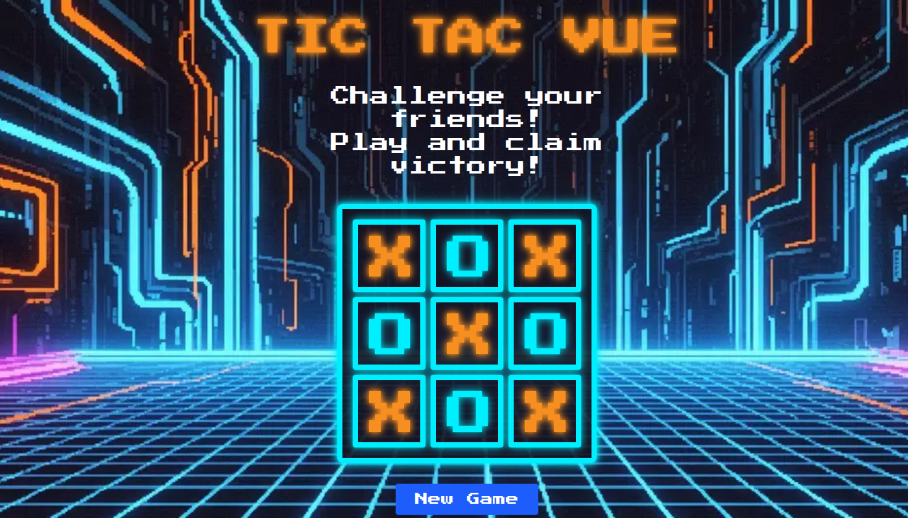

# TicTacVue

<p align="center">
  
</p>

TicTacVue is a retro-inspired Tic Tac Toe game built with Vue 3, Vite, Pinia, and Tailwind CSS. Challenge your friends, track your score, and enjoy a pixel-art look with custom fonts and responsive design.

## 🚀 Demo

Try it live: [https://tictacvue.vercel.app/](https://tictacvue.vercel.app/)

## Features

- Play Tic Tac Toe against a friend
- Custom player names (max 4 characters, no spaces)
- Score tracking for X, O, and draws
- Responsive design for desktop and mobile
- Retro pixel-art style with Press Start 2P font
- Social sharing preview (Open Graph)
- Built with Vue 3, Vite, Pinia, and Tailwind CSS

## Getting Started

Clone the repository and install dependencies:

```sh
npm install
```

### Run in Development Mode

```sh
npm run dev
```

### Build for Production

```sh
npm run build
```

## Project Structure

- `src/` — Main source code (components, store, styles)
- `public/` — Static assets (favicon, og-image, robots.txt)
- `index.html` — App entry point

## Credits

- [Press Start 2P font](https://fonts.google.com/specimen/Press+Start+2P)
- Icons from [FontAwesome](https://fontawesome.com/) and custom SVGs

## License

MIT

### Lint with [ESLint](https://eslint.org/)

```sh
npm run lint
```

## Branching Strategy

Development is primarily done on the `development` branch. New features and bug fixes should be implemented in dedicated branches based on the following strategy:

- `main`: Stable production-ready code
- `development`: Active development branch
- `feature/<feature-name>`: For new features
- `hotfix/<hotfix-name>`: For urgent fixes

When a feature or fix is complete, merge it into `development`. Periodically, merge `development` into `main` for releases.
